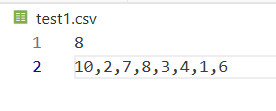
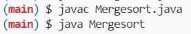

# Merge Sort with Multithreads | A Java Application

### GitHub link for this project  
https://github.com/Chau-Nguyen-Developer/mergeSort-multithread-java

### What is it about?  

This is a program that use multi-thread to do merge sort on an array of integer.  

The integer list is split into two smaller sublists. Each sublists is sorted con-currently using two seperate threads, applying the merge sort algorithm, which has a time complexity of O(n.logn). Once both sublists are sorted (recursively && single-threaded on the assigned thread), the main thread acts as the merging thread to combine them into a single sorted list.  

The input data is read from a .CSV file, with the file name provided by the user. 

### File that is accepted
File's type: CSV  (Comma-Separated Values)
Format:
* 1st line: number of integers
* 2nd line: the array of integers that you want to sort (integers separated by commas)  

Example:  

  

You can create your test cases in the same folder of project. 

### How to run the code  

There are several ways to run the application.  

#### Using Codesapce 
You can fork the project using your GitHub account, open GitHub Codespace, and use javac and java commands. (look at step 2 and 3 of "Using your device" section)

#### Using your device (laptop/PC)
0. Make sure you have Java Virtual Machine installed in your device.  

1. Download Zip files or clone this project into your chosen folder.  
For those who has Git install and want to clone it:
```
git clone git@github.com:Chau-Nguyen-Developer/mergeSort-multithread-java.git
```

2. Run ```javac``` command to transform Java source code files into Java bytecode files
```
javac Mergesort.java
```
  
3. Use ```java``` command to launch Java application.
```
java Mergesort
```  
Example:  

  


4. Type in the correct file's name where your unsorted list is contained. **Do not forget the .csv extension.**  
Example:  

  

5. The process will automatically terminated when file is not found, file has wrong format, or file has empty array.  

### Some comments about multithreads
The number of implemented threads is fixed in this application. I chose 3 threads instead of allowing each recursive call to make two threads as creating too many threads will cause many overheads (e.g. context switching overhead) and slow everything down.  

### Acknowledgement, some good reads, and more informative Links
[Youtube | Learn Merge Sort in 13 minutes](https://www.youtube.com/watch?v=3j0SWDX4AtU)  
(I used this video to review about merge sort algorithm. A very good video to watch. After getting the idea, I implemented the technique myself. It's such a good feeling to be able to write code myself.)

[Youtube | Merge sort in 3 minutes](https://www.youtube.com/watch?v=4VqmGXwpLqc)  
[Document | Getting started with Java in VS Code](https://code.visualstudio.com/docs/java/java-tutorial)  
[Stack Overflow | Does multithreading always yield better performance than single threading ?](https://stackoverflow.com/questions/27319446/does-multithreading-always-yield-better-performance-than-single-threading)  
(A very good explanation on why multithreading is not always good.)

ChatGPT Free Tier (default version GPT-5 as of 10/25/2025): I lean on ChatGPT to help me review on how to read on .CSV file from user and caught errors when exceptions occur. 

### Future plan
Convert this to generics in Java --> able to sort more generic things besides integer. 

Will convert this command-line application to a Graphical User Interface app using Java Swing.  

Write this application in C. 

Write this application in C++. 


